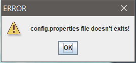
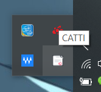
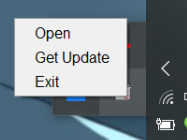
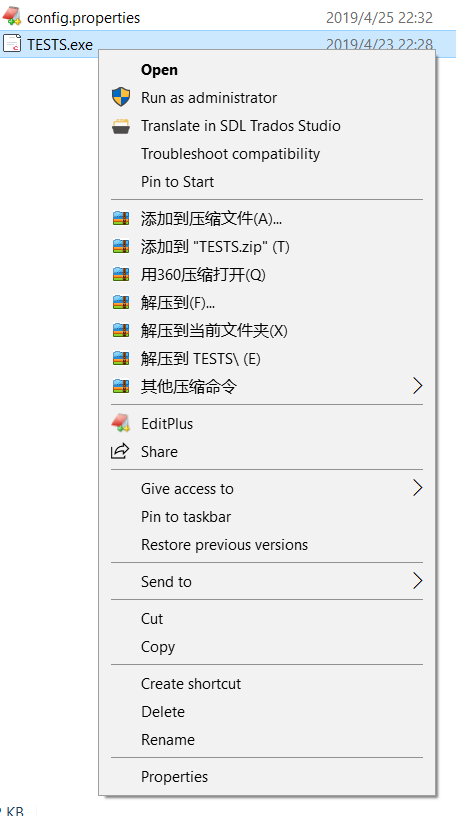

# TESTS
## 软件操作说明
### config.properties 文件
详见config.properties 文件内的说明，以文本方式打开  

  
不要删除config.properties 文件，否则程序不能运行！！！  
  
  
  
如上图所示，messageLabel.text= 后面填写某次考试的名称(该部分由HTML编写，详见congfig文件说明)，test.endDate= 某次考试的截至日期(注意格式一定是 yyyy-MM-dd,不要有错误！)，test.name= 某次考试的名称(汉字需转换为Unicode字符)  
注意以上涉及汉字的部分都需将汉字转换成Unicode字符！

### 操作说明
  
鼠标右键单击界面，可退出程序  
  
  
   
点击 x 号，可将软件最小化至系统托盘，系统托盘可显示本次考试名称
  
  
  
鼠标右键系统托盘，可选择相关选项  
  
  
### 关于软件自启
  
右键单击 TESTS.exe -> 创建快捷方式 -> 将此快捷方式移动至 C:\Users\你的计算机用户名\AppData\Roaming\Microsoft\Windows\Start Menu\Programs\Startup 即可实现开机自启
