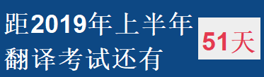
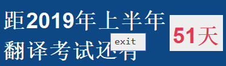
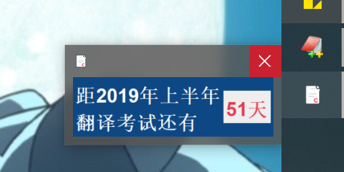

# TESTS
## 软件操作说明
### config.properties 文件
该文件内容如下：  

----------------------------------------------------------文件开始--------------------------------------------------------------------  
\# config file, do not delete !  

\# 考试信息，内容格式符合HTML语法规则，若为中文则需要将中文转换成 Unicode 字符 [( http://tool.chinaz.com/tools/unicode.aspx 中文转Unicode网站 )]   
\# 格式为 <html> 此处为填写的内容 (英文或者Unicode字符) <html>  
\# 格式不要写错！！！                                                                                                                        
\# e.g.  
\# messageLabel.text=<html>\u8DDD2019\u5E74\u4E0A\u534A\u5E74 \u7FFB\u8BD1\u8003\u8BD5\u8FD8\u6709<html>  
\# messageLabel.text=<html>\u8DDD2020\u5E74\u8003\u7814\u8FD8\u6709<html>  
\# messageLabel.text=<html>\u8DDD2019\u5E74\u9AD8\u8003\u8FD8\u6709<html>  

messageLabel.text=<html>\u8DDD2019\u5E74\u4E0A\u534A\u5E74 \u7FFB\u8BD1\u8003\u8BD5\u8FD8\u6709<html>  

\# 考试的终止时间  
test.endDate=2019-06-15  
\# 考试的名称  
test.name=CATTI  

------------------------------------------------------------文件结束-----------------------------------------------------------------  
  
如上图所示，messageLabel.text= 后面填写某次考试的名称(该部分由HTML编写，详见congfig文件说明)，test.endDate= 某次考试的截至日期(注意格式一定是 yyyy-MM-dd,不要有错误！)，test.name= 某次考试的名称(汉字需转换为Unicode字符)  
注意以上涉及汉字的部分都需将汉字转换成Unicode字符！

### 操作说明
  
鼠标右键单击界面，可退出程序  
  
  
点击 x 号，可将软件最小化至系统托盘
